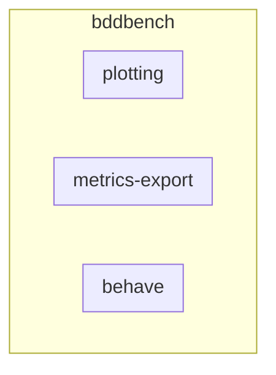
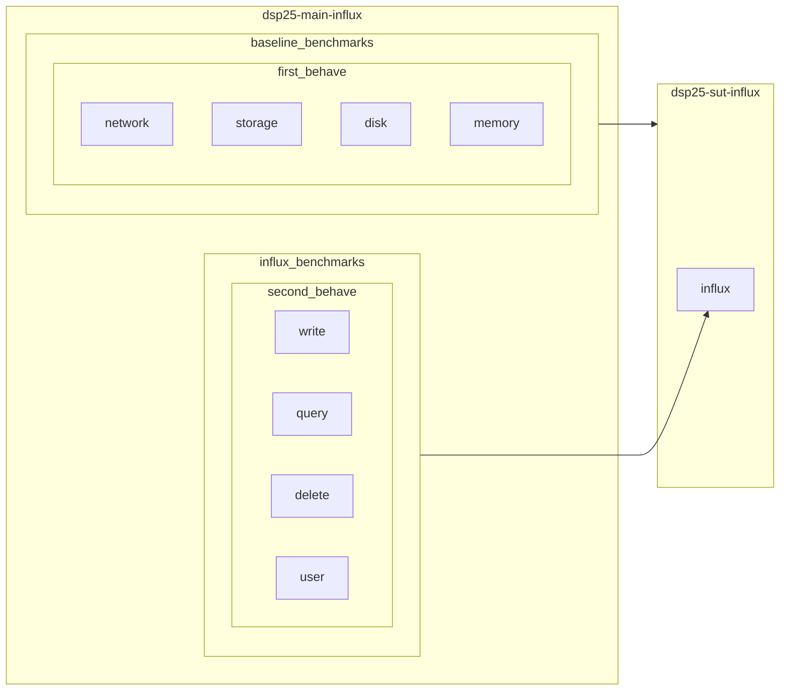

# General

## Nomenclature



## Default Benchmark Sequence

```mermaid
sequenceDiagram
    participant Trigger as external trigger
    participant Main as dsp25-main-influx
    participant SUT as dsp25-sut-influx

    Trigger->>Main: start behave
    activate Main

    rect rgb(235, 235, 255)
        Note over Main: behave → before_all

        loop features
            rect rgb(235, 255, 235)
                Note over Main: before_feature

                loop scenarios
                    rect rgb(255, 245, 230)
                        Note over Main: before_scenario

                        loop steps
                            Note over Main: before_step
                            Main->>SUT: execute step
                            Main->>Main: write KPIs
                            Note over Main: after_step
                        end

                        Note over Main: after_scenario
                    end
                end

                Note over Main: after_feature
            end
        end

        Note over Main: after_all
    end

    deactivate Main

    Main->>Trigger: signaling back
```



## Benchmark Overwie
we first want to benchmark the host system, where our influx service is running on. This is shown in `baseline_benchmarks`.
Then we proceed to benchmark the influx service itself, which is shown in `influx_benchmarks`.
The stress-ng can also be running during the `influx_benchmarks`. As show [here](https://github.com/DPS25/bddbench/pull/48#issuecomment-3588390557).



# Running the Environment

The Nix environment provides a fully configured setup for your project. To start it:

```bash
# Set ENV_NAME to one of the environments in envs/
export ENV_NAME=NAME_OF_YOUR_ENV && nix develop
```

* `ENV_NAME` specifies which environment configuration to use (found in the `envs/` folder).
* `nix develop` starts a Nix shell with all the required dependencies and environment variables.

Example output:

```bash
`export ENV_NAME=johann && nix develop`
🔐 Loading secrets from /nix/store/j2v44phb5lkpzq9yvyzfxh2yhbvgqx9w-source/secrets
🔑 Loading main_influx.enc.yaml...
🔑 Loading sut_influx.enc.yaml...
🔗 Creating symlink .env → ./envs/johann.env
```

* `🔐 Loading secrets...` → your encrypted secrets are being loaded.
* `🔑 Loading ...` → individual secret files for InfluxDB are being decrypted.
* `🔗 Creating symlink ...` → a `.env` file is created pointing to your chosen environment file.

---

## Environment Variables

Inside the Nix shell, these environment variables are automatically set:

```bash
INFLUXDB_SUT_ORG=3S
MAIN_INFLUX_TOKEN=
INFLUXDB_SUT_BUCKET=dsp25
INFLUXDB_MAIN_BUCKET=dsp25
INFLUXDB_SUT_URL=http://127.0.0.1:8001
INFLUXDB_MAIN_URL=http://localhost:8000
MAIN_INFLUX_ADMIN_PASSWORD=
SUT_INFLUX_TOKEN=
INFLUXDB_MAIN_ORG=3S
SUT_INFLUX_ADMIN_PASSWORD=
```

These variables configure connections to your InfluxDB instances. For example:

* `INFLUXDB_MAIN_URL` → the URL of your main InfluxDB server.
* `MAIN_INFLUX_TOKEN` → authentication token for the main InfluxDB.
* `SUT_INFLUX_TOKEN` → token for the SUT InfluxDB instance.

---

## parallel_stress command
```bash
python features/steps/parallel_stress.py \
  --host nixos@"hostname" \
  --presets cpu4 \
  --feature features/influx_query_benchmark.feature \
  --tags "query and normal"
```
- hostname of SUT can be found in your local config file under ```~/.ssh/config```
- stress presets are found in ```hosts/dsp25-base.nix``` in the nix repo


---

## Adding Packages

If you need extra Python packages inside the Nix shell, use `uv`:

```bash
uv add PACKAGE_NAME
```

* `uv` is like `pip` but faster and better

## Get Debug Info
If you encounter issues while executing, you can gather debug information by running:

```bash
tail -f reports/behave.log
```


