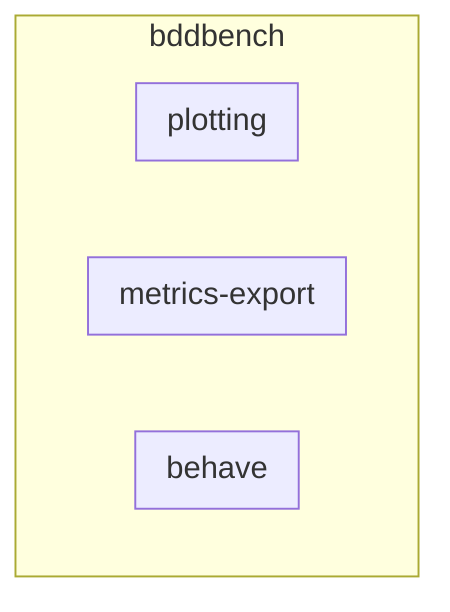
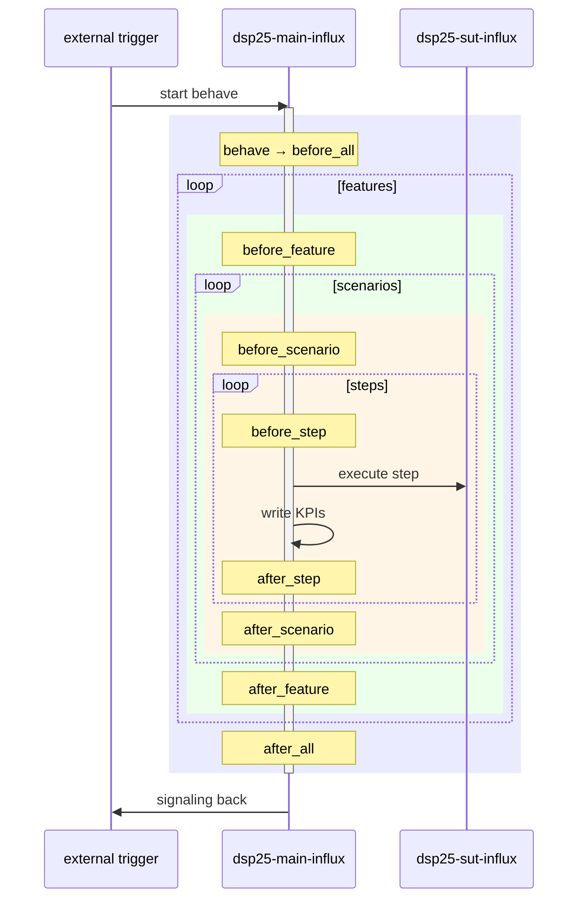

# General

## Nomenclature



## Default Benchmark Sequence



# Running the Environment

The Nix environment provides a fully configured setup for your project. To start it:

```bash
# Set ENV_NAME to one of the environments in envs/
export ENV_NAME=NAME_OF_YOUR_ENV && nix develop
```

* `ENV_NAME` specifies which environment configuration to use (found in the `envs/` folder).
* `nix develop` starts a Nix shell with all the required dependencies and environment variables.

Example output:

```bash
`export ENV_NAME=johann && nix develop`
🔐 Loading secrets from /nix/store/j2v44phb5lkpzq9yvyzfxh2yhbvgqx9w-source/secrets
🔑 Loading main_influx.enc.yaml...
🔑 Loading sut_influx.enc.yaml...
🔗 Creating symlink .env → ./envs/johann.env
```

* `🔐 Loading secrets...` → your encrypted secrets are being loaded.
* `🔑 Loading ...` → individual secret files for InfluxDB are being decrypted.
* `🔗 Creating symlink ...` → a `.env` file is created pointing to your chosen environment file.

---

## Environment Variables

Inside the Nix shell, these environment variables are automatically set:

```bash
INFLUXDB_SUT_ORG=3S
MAIN_INFLUX_TOKEN=
INFLUXDB_SUT_BUCKET=dsp25
INFLUXDB_MAIN_BUCKET=dsp25
INFLUXDB_SUT_URL=http://127.0.0.1:8001
INFLUXDB_MAIN_URL=http://localhost:8000
MAIN_INFLUX_ADMIN_PASSWORD=
SUT_INFLUX_TOKEN=
INFLUXDB_MAIN_ORG=3S
SUT_INFLUX_ADMIN_PASSWORD=
```

These variables configure connections to your InfluxDB instances. For example:

* `INFLUXDB_MAIN_URL` → the URL of your main InfluxDB server.
* `MAIN_INFLUX_TOKEN` → authentication token for the main InfluxDB.
* `SUT_INFLUX_TOKEN` → token for the SUT InfluxDB instance.

---

## Adding Packages

If you need extra Python packages inside the Nix shell, use `uv`:

```bash
uv add PACKAGE_NAME
```

* `uv` is like `pip` but faster and better

## Get Debug Info
If you encounter issues while executing, you can gather debug information by running:

```bash
tail -f reports/behave.log
```

